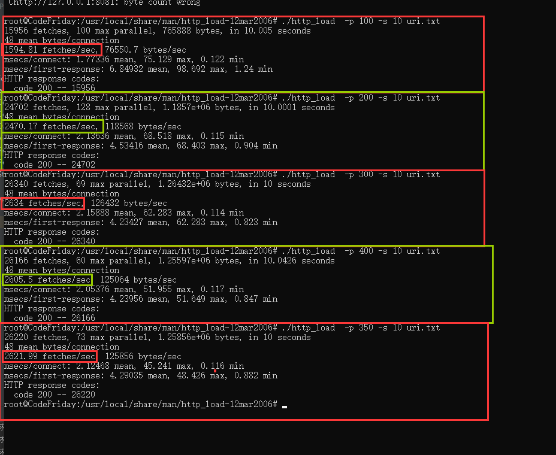

# HttpServer-NIO-BIO--Multithreading
多种IO模型实现HTTPServer

### 多线程对路复用版本用于最终测试使用，支持长连接

### 性能

#### 线程池版本：2700左右QPS

#### BIO：约1800QPS

#### Netty框架测试：约1800左右QPS

## 总结

自己写的BIO模型一个线程负责接收处理连接事件，然后多个线程负责处理建立的连接的上的请求事件并给出响应。

测试工具使用http_load，实际只测试获得一个index页面，理论上来说测试并不是特别严谨，但是得到的对比结果也有一定的可靠性，因为控制变量其他条件基本一致，BIO模型优势是事件驱动的IO模型，比较节省不必要的运行资源，缺点是线程之间通信开销比较大，但是使用同步IO模型似乎不好实现长连接~，而且我的BIO中长连接没有解决半包黏包问题。

多路复用器使用的是select，要得达到比较好的效果应该还得使用epoll来，还得写C，NGINX的5w并发是真的吊，Redis的10w都是C语言写的~